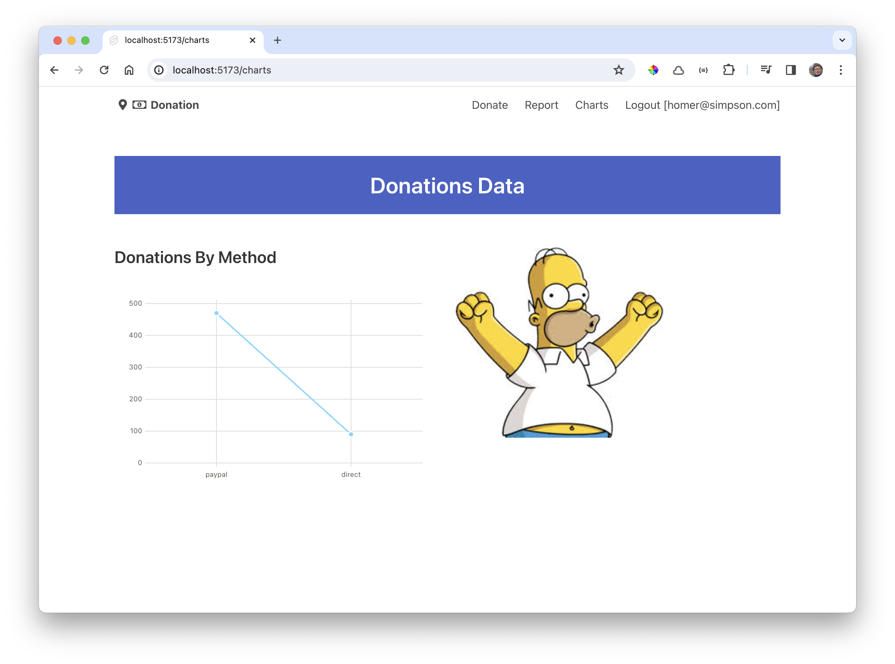
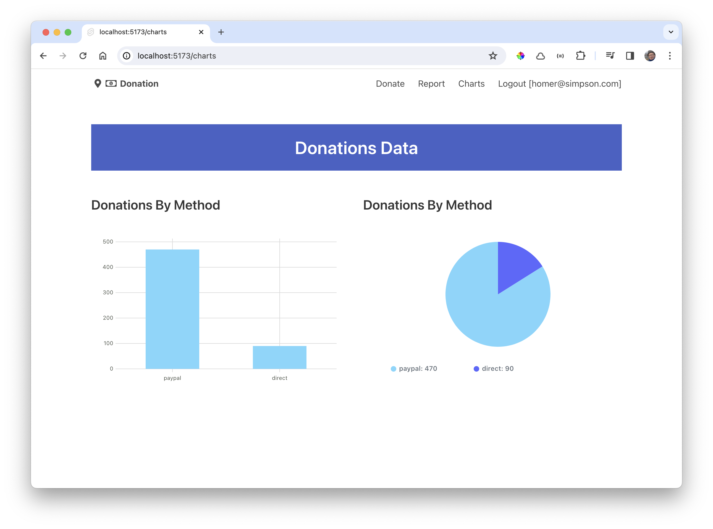

# Donations by Method

We can start by introducing a +page.ts component to generate the data for the chart. 

### src/routes/charts/+page.svelte

~~~typescript
import { donationService } from "$lib/services/donation-service";

export const ssr = false;
const chartData = {
  labels: ["Sun", "Mon", "Tues", "Wed", "Thurs", "Fri", "Sat"],
  datasets: [
    {
      values: [10, 12, 3, 9, 8, 15, 9]
    }
  ]
};

export const load = async () => {
  donationService.checkPageRefresh();
  return {
    byMethod: chartData
  };
};
~~~

Then we can load this data from the ux;

### src/routes/charts/+page.svelte

~~~html

<Menu />
<Heading title="Donations Data" />

  

    <h1 class="title is-4">Donations By Method</h1>
    <Chart data={data.byMethod} type="line" />
  

  

    
  

~~~

This should continue to work as before:

Change +page.ts now to actually acquire the latest donations, and set up the data for the chart to display the data by donation method:

### src/routes/charts/+page.ts

~~~typescript
import { donationService } from "$lib/services/donation-service";
export const ssr = false;

const donationsByMethod = {
  labels: ["paypal", "direct"],
  datasets: [
    {
      values: [0, 0]
    }
  ]
};

export const load = async () => {
  donationService.checkPageRefresh();
  const donationList = await donationService.getDonations();
  donationList.forEach((donation) => {
    if (donation.method == "paypal") {
      donationsByMethod.datasets[0].values[0] += donation.amount;
    } else if (donation.method == "direct") {
      donationsByMethod.datasets[0].values[1] += donation.amount;
    }
  });
  return {
    byMethod: donationsByMethod
  };
};
~~~

In the above we are retrieving the all donations - totalling the donations by method, and the passing this data to the chart:

Change the chart type to `bar`:

### src/routes/charts/+page.svelte

~~~html
//...
    <Chart data={data.byMethod} type="bar" />
//...
~~~

We could lay out two charts on the same page:

### src/routes/charts/+page.svelte

~~~html
<Menu />
<Heading title="Donations Data" />

  

    <h1 class="title is-4">Donations By Method</h1>
    <Chart data={data.byMethod} type="bar" />
  

  

    <h1 class="title is-4">Donations By Method</h1>
    <Chart data={data.byMethod} type="pie" />
  

~~~

We can frame both charts in a `Card`:

### src/routes/charts/+page.svelte

~~~html

<Menu />
<Heading title="Donations Data" />

  

    <Card title="Donations By Method">
      <Chart data={data.byMethod} type="bar" />
    </Card>
  

  

    <Card title="Donations By Method">
      <Chart data={data.byMethod} type="pie" />
    </Card>
  

~~~

