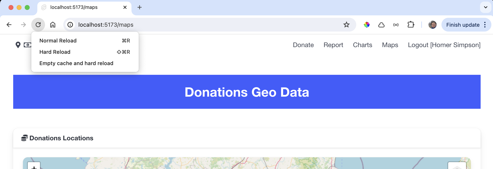
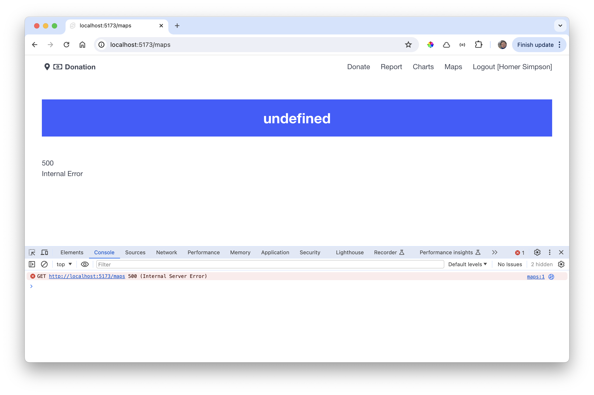

# Donations Markers

The next step will be to place markers at the location of each donation.

Introduce this new function into LeafletMap:

### src/lib/ui/LeafletMap.svelte

~~~typescript
  import L from "leaflet";
  //...

  export function addMarker(lat: number, lng: number) {
    L.marker([lat, lng]).addTo(imap);
  }
~~~

We trigger this function the Maps route:

### src/routes/maps/+page.svelte

~~~html

<Card title="Donations Locations">
  <LeafletMap height={60} bind:this={map} />
</Card>
~~~

The markers for our sample data should appear (you may need to pan and zoom to see the view below):

This may work as shown, or you may get an error. Either way, try the following - try a hard reload, forcing an Empty cache and hard reload as shown here (hold ctrl+right click on reload to get the menu):

This will cause a fail:

To fix this, introduce the following module:

### src/routes/maps/+page.ts

~~~typescript
export const ssr = false;
~~~

Try the hard reload again - this time it should work reliably.

It works because we have forcibly disabled Server Side Rendering (SSR), which is the cause of the issue. The reason there was an exception is due to the way the Leaflet library is composed - it was never intended to load anywhere but a browser environment, and can cause an exception on the server side. More on this in the next topic.
